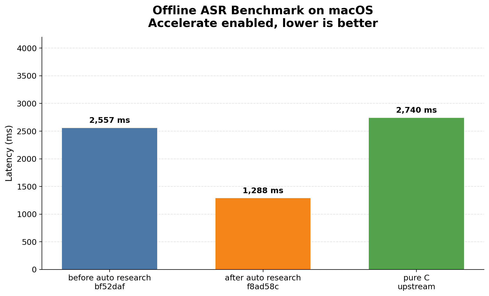
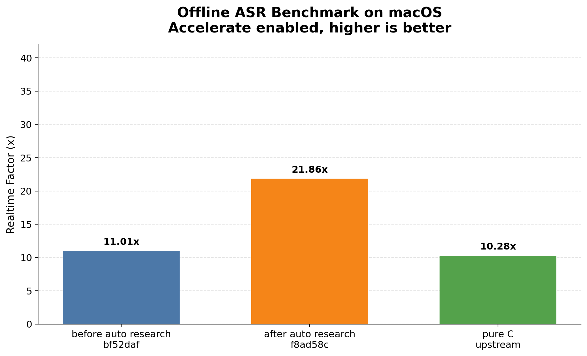

# Benchmark Report

## Methodology

- Offline benchmark on the same input WAV and model across three implementations.
- Rust baseline: `before auto research bf52daf`.
- Rust optimized: `after auto research f8ad58c`.
- Upstream baseline: `antirez/qwen-asr` pure C implementation.
- macOS Accelerate enabled.
- Runs per target: `3`.
- Modes requested: `offline`.

## Environment

- Machine arch: `arm64`
- macOS: `26.3.1`
- Model dir: `/Users/lizhuo/owork/q-asr/qwen3-asr-0.6b`
- Input file: `/Users/lizhuo/owork/q-asr/bench/samples/audio.wav`

## Results

| Implementation | Commit | Total ms | RTF |
|---|---:|---:|---:|
| before auto research | `bf52daf` | `2,557` | `11.01x` |
| after auto research | `f8ad58c` | `1,288` | `21.86x` |
| pure C upstream | - | `2,740` | `10.28x` |

## Findings

- With Accelerate enabled, `after auto research f8ad58c` is `1.99x` faster than `before auto research bf52daf`.
- With Accelerate enabled, `after auto research f8ad58c` is `2.13x` faster than the upstream pure C implementation.

