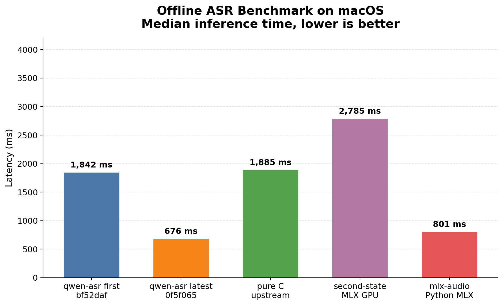
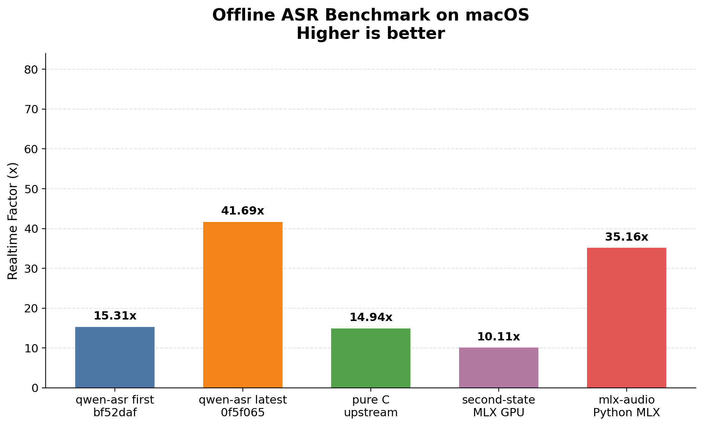

# Benchmark Report

## Methodology

- Offline benchmark on the same input WAV and model across five implementations.
- qwen-asr first: `bf52daf`.
- qwen-asr latest: `0f5f065`.
- Upstream C: `antirez/qwen-asr`.
- GPU baselines: `second-state/qwen3_asr_rs` MLX and `mlx-audio` Python MLX.
- Implementations are benchmarked sequentially, not in parallel; each round is a standalone process invocation.
- Primary metric is median inference time across standalone rounds for every implementation.
- qwen-asr and pure C use their internal inference timers. MLX-based implementations are timed after model load with explicit GPU synchronization.
- macOS Accelerate enabled for qwen-asr and pure C where applicable.
- Wall-clock time is retained as a secondary metric.
- Standalone rounds per target: `10`.
- Modes requested: `offline`.

## Environment

- CPU: `Apple M5`
- Cores: `10 physical / 10 logical`
- Memory: `32.0 GB`
- Machine arch: `arm64`
- macOS: `26.4.1`
- Rustc: `rustc 1.90.0 (1159e78c4 2025-09-14)`
- Model dir: `/Users/lizhuo/owork/q-asr/qwen3-asr-0.6b`
- Input file: `/Users/lizhuo/owork/q-asr/bench/samples/audio.wav`

## Results

| Implementation | Commit | Median inference ms | Mean ms | Best ms | RTF |
|---|---:|---:|---:|---:|---:|
| qwen-asr (first) | `bf52daf` | `1,842` | `1,853` | `1,820` | `15.31x` |
| qwen-asr (latest) | `0f5f065` | `676` | `678` | `668` | `41.69x` |
| pure C upstream | `b00b789` | `1,885` | `1,885` | `1,861` | `14.94x` |
| second-state MLX GPU | `3fa6734` | `2,785` | `2,808` | `2,745` | `10.11x` |
| mlx-audio Python MLX | `0.4.3` | `801` | `820` | `788` | `35.16x` |

Wall-clock timing

| Implementation | Commit | Median wall-clock ms | Mean ms | Best ms | Wall-clock RTF |
|---|---:|---:|---:|---:|---:|
| qwen-asr (first) | `bf52daf` | `2,171` | `2,205` | `2,150` | `12.99x` |
| qwen-asr (latest) | `0f5f065` | `1,263` | `1,289` | `1,252` | `22.34x` |
| pure C upstream | `b00b789` | `2,154` | `2,148` | `2,125` | `13.08x` |
| second-state MLX GPU | `3fa6734` | `2,982` | `3,049` | `2,940` | `9.44x` |
| mlx-audio Python MLX | `0.4.3` | `1,855` | `1,918` | `1,806` | `15.18x` |

## Findings

- qwen-asr latest `0f5f065` is `2.72x` the speed of qwen-asr first `bf52daf`.
- qwen-asr latest `0f5f065` is `2.79x` faster than the upstream pure C implementation.
- qwen-asr latest `0f5f065` is `4.12x` faster than second-state MLX GPU by inference latency.
- qwen-asr latest `0f5f065` is `1.18x` faster than mlx-audio Python MLX by inference latency.

